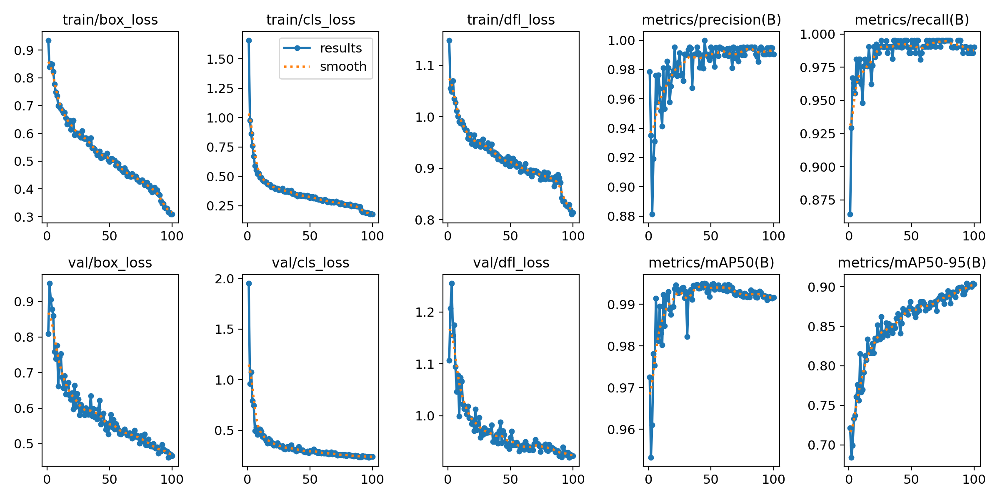

# YOLOv8 Barcode Detector

This project uses the YOLOv8 model to detect barcodes in images. The script processes all images in a specified folder and saves the results with detected barcodes drawn on them.

## Features
- Detects barcodes in images using a trained YOLOv8 model.
- Processes all images in a folder.
- Saves results with bounding boxes drawn around detected barcodes.




## Requirements
To install the required dependencies, run:
```bash
pip install -r requirements.txt
```

## Usage
1. Place the images you want to process in the `img/` folder.
2. Run the script:
```bash
python predict.py
```
3. Processed images with detected barcodes will be saved in the `output/` folder.

## File Structure
```
project/
│
├── img/                # Folder containing input images
├── output/             # Folder where results will be saved
├── runs/               # Folder containing training results
├── predict.py          # Script to run predictions
├── requirements.txt    # Dependencies
└── README.md           # Project documentation
```

## Notes
- Ensure the trained model file exists at `runs/train/barcode_detection4/weights/best.pt`.
- The confidence threshold for predictions is set to 0.25 by default.

## License
This project is open-source and available under the [MIT License](LICENSE).
